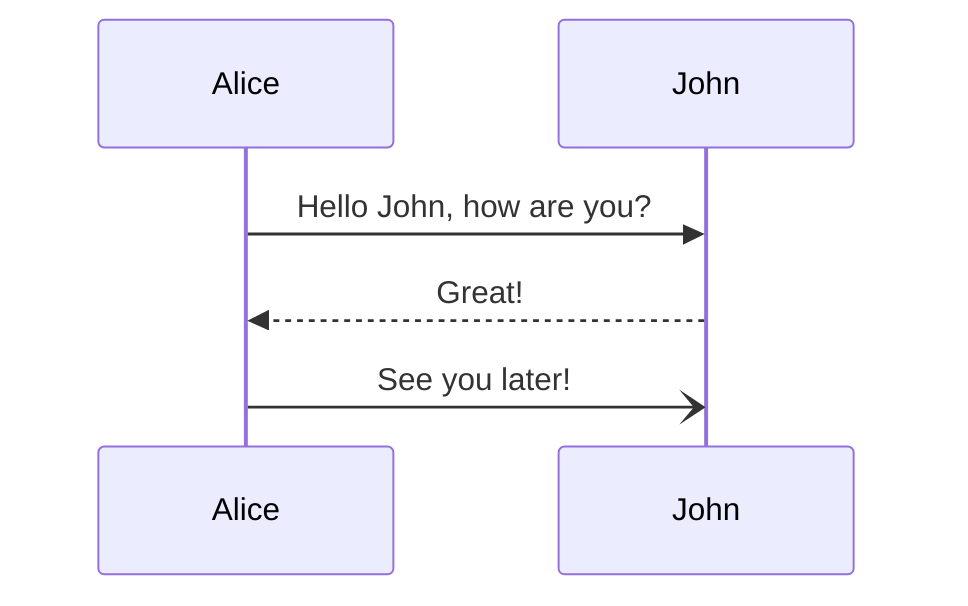
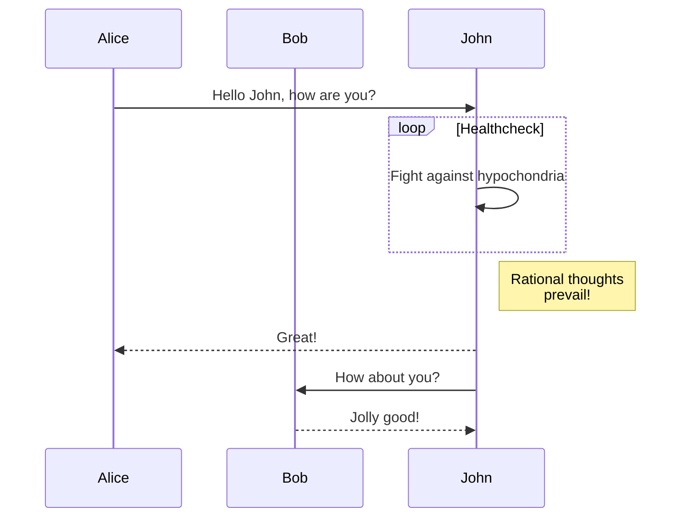
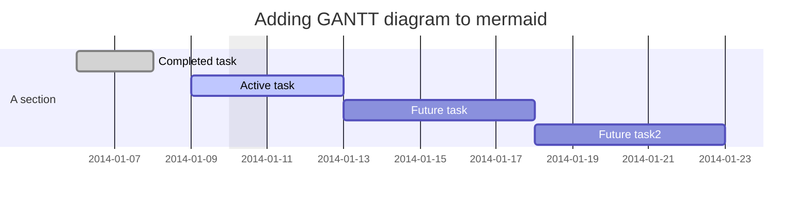
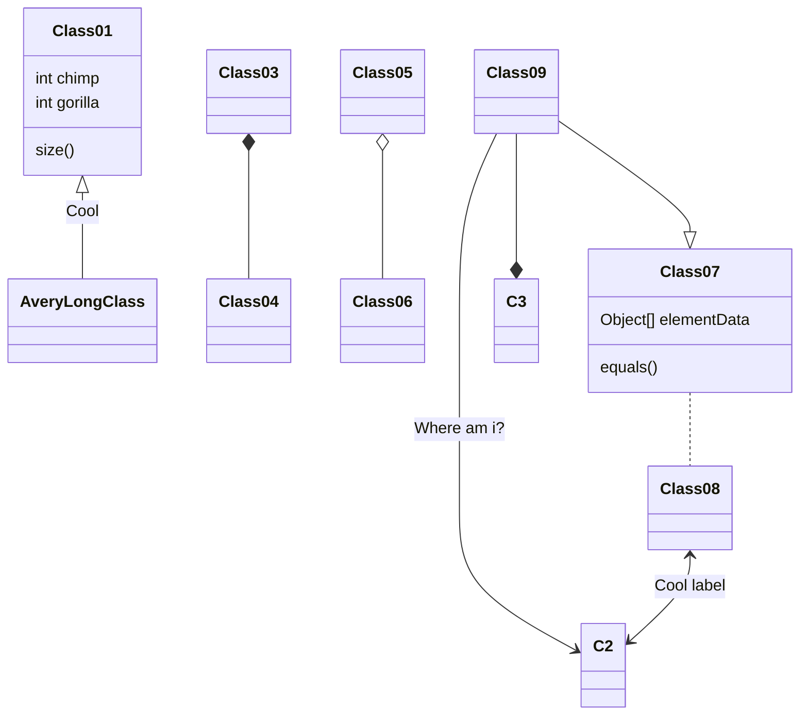

# d0xigen d0xigen

:icon{name="logos:adobe-after-effects"}

Nuxt 3 theme for [d0rich](https://github.com/d0rich) documentation sites.

## Installation

```bash
npm i d0xigen
```

## Usage

```ts
// nuxt.config.ts
export default defineNuxtConfig({
  extends: ['d0xigen'] 
})
```

## Mermaid


 






## PlantUML

```plantuml Your title
class SimplePlantUMLPlugin {
    + transform(syntaxTree: AST): AST
}
```