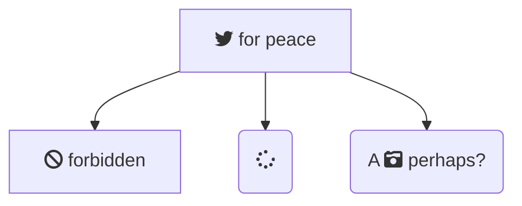

# d0xigen d0xigen

Nuxt 3 theme for [d0rich](https://github.com/d0rich) documentation sites.

## Installation

```bash
npm i d0xigen
```

## Usage

```ts
// nuxt.config.ts
export default defineNuxtConfig({
  extends: ['d0xigen']
})
```

## Mermaid



<pre class="mermaid">
flowchart TD
    B["fab:fa-twitter for peace"]
    B-->C[fa:fa-ban forbidden]
    B-->D(fa:fa-spinner)
    B-->E(A fa:fa-camera-retro perhaps?)
</pre>